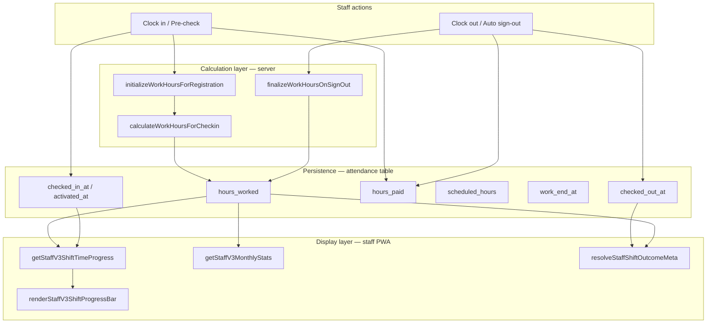
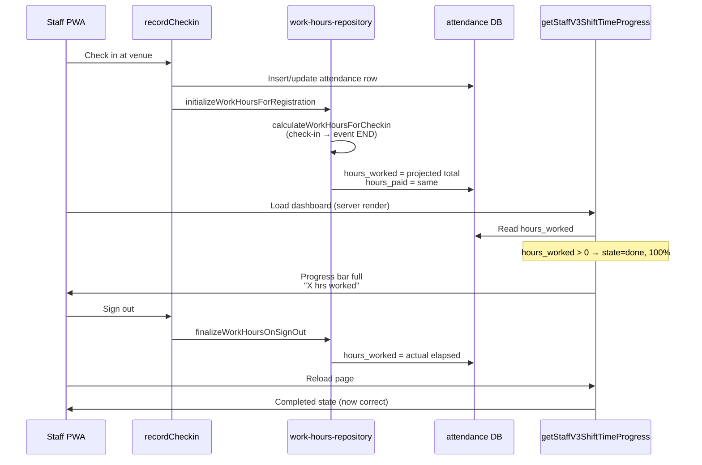

# Phase 3 — Live Hours Counter Investigation & Design

**Integrity ID:** `PHASE3-20260621-OLASENTRA`  
**Date:** 2026-06-21  
**Status:** Investigation complete — **no code changes, no deployments, no database changes**

---

## Executive summary

The “Live Hours Counter” in the staff experience is **not a real-time timer**. It is a **server-rendered progress bar** computed once per page load by `getStaffV3ShiftTimeProgress()` in `includes/staff-app-v3-data.php`.

The primary UX bug — **active shifts showing completed hours and a full progress bar** — is caused by a **display-layer vs persistence-layer mismatch**:

1. On check-in, `initializeWorkHoursForRegistration()` writes **projected** `hours_worked` (check-in → event end) into the database.
2. The progress function checks `if ($hoursWorked > 0)` **before** any live-clock logic, so it immediately renders state `done` at 100%.

Attendance calculations, invoices, and monthly dashboard totals all read the same `hours_worked` column — so the counter confusion also inflates **“Worked”** stats on the home dashboard during an active shift.

**Recommended path before coding:** **Option B (Dashboard logic fix)** — display-only live elapsed time for active shifts, exclude in-progress projected hours from dashboard aggregates, without changing check-in/sign-out persistence. Validate on device, then consider Option C only if tick-by-tick updates without refresh are required.

---

## 1. Live Hours flow (end-to-end)

### 1.1 Clock in

| Step | Component | What happens |
|------|-----------|--------------|
| Staff submits check-in | `recordCheckin()` → `includes/attendance-repository.php` | GPS v2 path or legacy insert |
| Attendance row created | `attendance` table | `checked_in_at`, `attendance_status`, optional `activated_at`, BIB, GPS fields |
| Work hours initialized | `initializeWorkHoursForRegistration()` → `includes/work-hours-repository.php` | Called on active check-in (`recordCheckin` line ~731) and legacy insert (~806), and on hibernation activation (`attendance-gps-phase1.php` ~103) |
| Hours written to DB | `calculateWorkHoursForCheckin()` | Sets `hours_worked`, `hours_paid`, `scheduled_hours`, `work_end_at` to **projected full shift** (work start = max(check-in, event start), work end = **event end time**, not “now”) |

**Important:** `hours_worked` at check-in is **not** “zero then count up”. It is **“hours you are expected to work if you stay until shift end”**.

### 1.2 Shift start (GPS v2 pre-check)

| Step | Component | What happens |
|------|-----------|--------------|
| Pre-check at venue | `attendance_status = pre_checked_in` | No work hours init yet (guarded in `initializeWorkHoursForRegistration`) |
| Event start reached | `activateHibernatedAttendance()` | Sets `active` + `activated_at`, then calls `initializeWorkHoursForRegistration()` |
| Display | Staff app | Same progress logic; once hours exist, bar shows “done” |

### 1.3 Active shift

| Layer | Behaviour |
|-------|-----------|
| **DB** | `hours_worked` / `hours_paid` hold projected or last-calculated values |
| **GPS monitor** | `staff-portal-shift.php` — geofence ping / auto sign-out (separate from hours display) |
| **Staff PWA progress bar** | `getStaffV3ShiftTimeProgress()` — **broken path** when `hours_worked > 0` (shows completed) |
| **Client JS** | **None** — no `setInterval` timer for hours; CSS transition only on bar width |
| **Mobile API** | Returns static `attendance.hours_worked` from DB — no progress percent field |

### 1.4 Shift end

| Trigger | Component | Hours update |
|---------|-----------|--------------|
| Manual / GPS sign-out | `finalizeWorkHoursOnSignOut()` → `includes/attendance-gps-signout.php` | Recalculates from `activated_at` or `checked_in_at` to actual sign-out time; caps at event end |
| Auto sign-out | `autoSignOutAttendance()` | Same finalization |
| Event end (no sign-out) | Cron / close logic (separate) | May mark no-show or close — not part of live counter |

After sign-out, `hours_worked` reflects **actual elapsed** (correct for completed shifts).

### 1.5 Clock out

Sign-out flows call `finalizeWorkHoursOnSignOut()`, which updates `work_end_at`, `hours_worked`, and `hours_paid` (unless admin locked via `hours_adjusted_by`).

### 1.6 Overnight shift

Three different overnight behaviours exist in code:

| Function | Overnight handling |
|----------|-------------------|
| `getStaffV3ShiftScheduledHours()` | If `end <= start`, adds **+1 day** to end |
| `getStaffV3ShiftTimeProgress()` live branch | Same +1 day on end datetime |
| `calculateWorkHoursForCheckin()` | If `end <= start`, adds **+8 hours** to end (not +1 day) — **inconsistent** |

Additional overnight issues in **display**:

- Live branch requires `$eventDate === date('Y-m-d')` (uses raw `date()`, not `getOperationalTodayYmd()`).
- After midnight, while staff are still on an overnight shift whose `event_date` was **yesterday**, the live branch **does not run** → progress falls back to scheduled label or “done” via `hours_worked`.

---

## 2. Data source map

| UI element | Source | File(s) |
|------------|--------|---------|
| **Progress bar label & %** | `getStaffV3ShiftTimeProgress($row)` | `includes/staff-app-v3-data.php` |
| **Progress bar render** | `renderStaffV3ShiftProgressBar()` | `includes/staff-app-v3-shell.php` |
| **Today’s shift card** | Same progress function | `includes/staff-app-v3-pages.php` |
| **Shift list cards** | Same | `includes/staff-app-v3-shell.php` → `renderStaffV3ShiftCard()` |
| **Badge (“Checked in” / “Completed”)** | `resolveStaffShiftOutcomeMeta()` | `includes/staff-app-v3-data.php` |
| **Dashboard “Worked” stat** | `SUM(a.hours_worked)` month-to-date | `getStaffV3MonthlyStats()` |
| **Dashboard “Paid hrs” stat** | `SUM(a.hours_paid)` | Same |
| **Footer scheduled hours text** | `getStaffV3ShiftHoursLabel()` — event start/end duration | `staff-app-v3-shell.php` |
| **Attendance hours (authoritative)** | `attendance.hours_worked`, `hours_paid` | DB, written by `work-hours-repository.php`, finalized on sign-out |
| **Paid hours (operational)** | Same column at sign-out; admin can adjust in Work Hours | `admin/work-hours.php`, `work-hours-repository.php` |
| **Mobile API hours** | `attendance.hours_worked` passthrough | `includes/mobile/mappers/MobileShiftMapper.php` |
| **Admin “attendance live” board** | Check-in counts / capacity — **not** staff hours timer | `assets/js/attendance-live.js`, `api/attendance-live.php` |

---

## 3. Root cause analysis

### 3.1 Why active shifts display completed hours

```php
// getStaffV3ShiftTimeProgress() — first branch wins
if ($hoursWorked > 0) {
    $state   = 'done';
    $label   = $hoursWorked . ' hrs worked';
    $percent = $hoursScheduled > 0
        ? (int) min(100, round(($hoursWorked / $hoursScheduled) * 100))
        : 100;
}
```

Because `initializeWorkHoursForRegistration()` sets `hours_worked` to ~full shift **at check-in**, the UI never reaches the `state = 'live'` branch.

**User sees:** Badge “Checked in” + progress “8.5 hrs worked” at 100% — while still on shift.

### 3.2 Why progress bars complete early

| Cause | Explanation |
|-------|-------------|
| **Projected hours at check-in** | Bar uses DB `hours_worked` / scheduled ratio → often 100% immediately |
| **No client refresh** | Even correct live math would freeze until page reload |
| **Late check-in still projects to event end** | `calculateWorkHoursForCheckin` uses event end as work end, not proportional elapsed |
| **Badge vs bar inconsistency** | Outcome meta uses window/check-out; progress uses `hours_worked` first |

### 3.3 Why overnight shifts behave differently

| Issue | Effect |
|-------|--------|
| `event_date !== today` after midnight | Live clock branch skipped |
| `date('Y-m-d')` vs `getOperationalTodayYmd($pdo)` | Inconsistent “today” across functions |
| `calculateWorkHoursForCheckin` +8h vs display +1 day | Different scheduled totals between DB and bar |
| Pre-check activation at `event_start` | Work hours init may use event start, not actual arrival |

---

## 4. Architecture diagram



---

## 5. Data flow diagram



---

## 6. Risk assessment

| Risk | Severity | Notes |
|------|----------|-------|
| Changing `initializeWorkHoursForRegistration` timing/values | **Critical** | Would affect invoices, work hours admin, commission lines, payroll exports |
| Display-only fix without dashboard stat fix | Medium | Bar fixed but “Worked” monthly stat still inflated |
| Mobile API contract change | High | Android reads `hours_worked`; new fields need API version agreement |
| Overnight edge cases | Medium | Date boundary bugs affect live branch only today |
| No JS timer | Low–Med | Staff must refresh to see movement even with correct server logic |
| `registrationHadVenueCheckin` vs progress | Low | Invoice fix uses stricter rules; display uses raw `hours_worked` |

---

## 7. User experience analysis

| Persona | Current experience | Pain |
|---------|-------------------|------|
| **Staff on active shift** | Sees full bar + “X hrs worked” immediately after check-in | Believes shift is finished; distrusts app |
| **Staff before check-in** | “Starts HH:MM” or scheduled hours | Generally OK |
| **Staff after sign-out** | Completed label + hours | Correct |
| **Staff overnight** | After midnight, bar may show scheduled text or wrong state | Confusing on late-night events |
| **Admin** | Work Hours page shows projected hours (operational truth for billing) | May match DB but not staff expectation |
| **Android app** | Static `hours_worked` from API | Same inflation if shown on device |

**UX principle for fix:** During an **active, not-checked-out** shift, staff should see **elapsed time** (or elapsed / scheduled), not **projected payroll hours**. Stored `hours_worked` can remain for back-office until sign-out.

---

## 8. Implementation options

### Option A — UI-only fix

**Scope:** Modify `getStaffV3ShiftTimeProgress()` (and bar rendering rules only).

**Approach:**

- If shift is **active** (checked in, not checked out, not no-show, window not closed): compute progress from **wall clock** (`now` vs event start/end), **ignore** `hours_worked` for display.
- If shift **completed** (checked out or window after): use `hours_worked` / `hours_paid` as today.

| | |
|--|--|
| **Benefits** | Smallest diff; no DB/schema/API change; no attendance architecture change |
| **Risks** | Monthly “Worked” stat still wrong; overnight date bugs remain unless fixed in same function; no live tick without refresh |
| **Effort** | **Small** (1–2 days incl. device test) |
| **Impact on attendance calculations** | **None** |
| **Impact on shift completion** | **None** |
| **Impact on existing records** | **None** |

---

### Option B — Dashboard logic fix (recommended)

**Scope:** Option A + dashboard aggregates + badge/progress consistency + overnight date alignment.

**Approach:**

- Display layer: same as Option A.
- `getStaffV3MonthlyStats()`: sum hours only where `checked_out_at IS NOT NULL` OR `attendance_status` in completed states — **exclude in-progress projected hours** from “Worked” / “Paid hrs” tiles.
- Align `getStaffV3ShiftTimeProgress()` to use `getOperationalTodayYmd($pdo)` consistently.
- Optionally align overnight scheduled hours with `getStaffV3ShiftScheduledHours()` (+1 day rule) in display only.
- Document that `resolveStaffShiftOutcomeMeta` label “Completed (Xh)” during active shift should not appear — verify branch order.

| | |
|--|--|
| **Benefits** | Fixes staff-facing counter **and** home dashboard confusion; still no persistence change |
| **Risks** | Monthly stat definition change — staff may notice lower “Worked” mid-shift (correct behaviour); must not touch invoice/work-hours SQL |
| **Effort** | **Medium** (3–5 days incl. regression on status page, shifts list, home) |
| **Impact on attendance calculations** | **None** (display/aggregate query filters only) |
| **Impact on shift completion** | **None** |
| **Impact on existing records** | **None** — historical rows unchanged; only how they are **summed for display** mid-month |

---

### Option C — Full live timer architecture

**Scope:** New read-only API endpoint (e.g. `/api/staff/shift-live-status.php` or mobile v1 extension), client `setInterval` in staff PWA, optional Android consumption.

**Approach:**

- Server exposes: `elapsed_seconds`, `scheduled_seconds`, `percent`, `state`, `display_hours` (computed, not DB).
- DB `hours_worked` unchanged until sign-out (persistence rule preserved).
- PWA polls every 30–60s or uses client-side clock from server-provided anchors.
- Mobile API: **new optional fields** (requires contract approval per project rules).

| | |
|--|--|
| **Benefits** | True live updates without full page reload; best UX; clear separation of display vs payroll hours |
| **Risks** | Mobile API contract touch; more moving parts; battery/network; must not duplicate finalize logic client-side |
| **Effort** | **Large** (1–2 weeks + Android if required) |
| **Impact on attendance calculations** | **None** if display-only endpoint |
| **Impact on shift completion** | **None** if read-only |
| **Impact on existing records** | **None** |

---

## 9. Recommended implementation path

**Phase 3 approval → implement Option B first**

1. **Device reproduction script** (manual QA checklist, not code):
   - Check in mid-shift → confirm bar moves from 0% over time (after fix).
   - Confirm badge stays “Checked in” until sign-out.
   - Confirm monthly “Worked” does not jump to full shift at check-in.
   - Overnight event: test before and after midnight.
2. **Implement Option B** in `staff-app-v3-data.php` + `staff-app-v3-pages.php` only.
3. **Do not change** `initializeWorkHoursForRegistration`, `finalizeWorkHoursOnSignOut`, GPS, BIB, or check-in paths.
4. **Regression:** admin Work Hours, commission invoices (billable filter), mobile API unchanged.
5. **Option C** only if product requires second-by-second updates without navigation refresh.

---

## 10. Verification checklist (before any fix)

- [ ] Reproduce on device: check-in → home “Today’s shift” bar
- [ ] Compare `hours_worked` in DB before/after check-in (admin Work Hours)
- [ ] Confirm badge text vs progress label mismatch
- [ ] Test with GPS v2 pre-check → activation path
- [ ] Test overnight event crossing midnight (Ireland timezone)
- [ ] Confirm Android app if it displays hours (Mobile API field only)

---

## 11. Files referenced (investigation only)

| File | Role |
|------|------|
| `includes/staff-app-v3-data.php` | `getStaffV3ShiftTimeProgress`, monthly stats, outcome meta |
| `includes/staff-app-v3-shell.php` | Progress bar HTML |
| `includes/staff-app-v3-pages.php` | Home dashboard stats + today card |
| `includes/work-hours-repository.php` | `calculateWorkHoursForCheckin`, `initializeWorkHoursForRegistration` |
| `includes/attendance-repository.php` | Check-in triggers work hours init |
| `includes/attendance-gps-phase1.php` | Hibernation activation → work hours init |
| `includes/attendance-gps-signout.php` | `finalizeWorkHoursOnSignOut` |
| `includes/staff-portal-shift.php` | GPS monitoring (parallel, not display) |
| `includes/mobile/mappers/MobileShiftMapper.php` | API hours passthrough |
| `assets/js/attendance-live.js` | Admin check-in board (unrelated to staff hours counter) |
| `assets/css/staff-app-v3.css` | Progress bar styling (`data-shift-progress="live"`) |

---

## 12. Success criteria (Phase 3)

| Criterion | Status |
|-----------|--------|
| Full understanding of current behaviour | **Complete** |
| No code changes | **Confirmed** |
| No database changes | **Confirmed** |
| No attendance architecture changes | **Confirmed** |
| No deployments | **Confirmed** |
| Recommended path documented | **Option B** |

---

*End of Phase 3 investigation report.*
