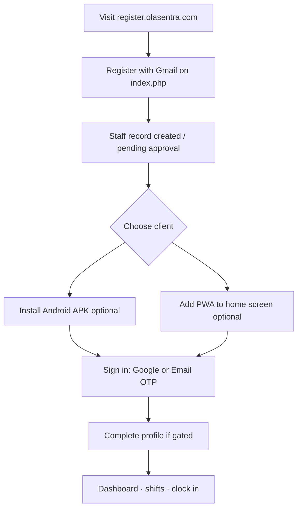

# Phase 5B — Authentication & PWA Product Decision Audit

**Date:** 2026-06-21  
**Type:** Product decision only — no code changes, no deployment  
**Inputs:** Phase 5A visibility audit, handover documentation (Phase 7 auth model), production snapshot, Android v1.0.15

---

## Executive recommendation

Documented product intent (June 2026 handover) is **dual staff sign-in: Google OR email OTP**, with the **same staff profile** when the email matches the record. The **Staff PWA should match Android** — not Google-only.

Today the PWA **under-delivers** against that intent (Google-only guest UI). Phase 5B recommends **restoring email OTP on the PWA login screen** and **keeping email + PPS as an optional legacy/venue path**, not removing any method. UI modernization (Phase 5 Clock In / GTBank orange) should proceed **after** login parity is approved.

---

## 1. Authentication Product Matrix

Classification key: **Required** = must remain available to staff · **Optional** = allowed but not primary · **Android Only** = supported only on native app today · **PWA Only** = supported only on web PWA · **Deprecated** = superseded for primary use but must not be removed

| Method | Product classification | Rationale |
|--------|------------------------|-----------|
| **Google Login** | **Required** (PWA + Android) | Primary path for staff who registered with Gmail; aligned with registration Google gate; documented in handover as co-primary with email OTP. |
| **Email OTP Login** | **Required** (PWA + Android) | Documented Phase 7 goal: non-Gmail staff (Outlook, Yahoo, company email). **Live on Android**; **missing PWA UI** — product gap, not intentional removal. |
| **Email + PPS Login** | **Optional** (PWA fallback) · **Required** (venue/event web flows) · **Deprecated** as *primary Staff PWA login* | Superseded by OTP for staff portal per Phase 7; `staff_google_signin_required` already hides PPS on gate when Google required. Still needed for venue QR / public check-in pages — separate surfaces, not staff-app home. |
| **Password Reset** | **Required** (capability) · **Android Only** (today) · **Optional** (PWA profile, future) | Change password exists in Android Settings via email OTP (`me/password`). No “Forgot password” on any login screen today — reset is **post-authentication**, not login recovery. |
| **Sign Up** | **Required** (PWA + Android) | Registration at `index.php`; Android “Apply to Join”; must remain visible on login. |

### Matrix (requested format)

| Method | Required | Optional | Android Only | PWA Only | Deprecated |
|--------|----------|----------|--------------|----------|------------|
| Google Login | **✓ Both platforms** | | | | |
| Email OTP Login | **✓ Both platforms** (intent) | | UI today only | | |
| Email + PPS Login | Venue flows | PWA when Google optional | | | Primary staff PWA login |
| Password Reset | Capability | PWA future | **Current UX** | | Login-screen forgot-password |
| Sign Up | **✓ Both platforms** | | | | |

---

## 2. User Journey Review

### New staff



**Product note:** Registration is Google-oriented; sign-in must accept **same email** via Google or OTP.

### Returning staff

| Step | Google user | Non-Gmail user |
|------|-------------|----------------|
| Open app | PWA `staff-app.php` or Android | Same |
| Sign in | **Sign in with Google** | **Sign in with Email** → OTP (Android ✓, PWA gap) |
| Session | Portal session (PWA) or JWT (Android) | Same |
| Next | Dashboard, clock in, messages | Same |

### Forgotten password

| Platform | Current journey | Product target |
|----------|-----------------|----------------|
| **Android** | Login → sign in → **Menu / Settings → Change Password** → email OTP → new password | Keep |
| **Staff PWA** | No login-level reset; no profile change-password UI equivalent surfaced | **Optional future:** profile hub link using existing mobile password OTP API |
| **Venue / email+PPS** | Not password-based | N/A |

**Product decision:** Do **not** add classic “Forgot password?” on login unless a dedicated recovery flow is scoped. Treat **password reset as authenticated account maintenance**, not unauthenticated login recovery (OTP login already covers “can’t use Google”).

### Non-Gmail user

| Need | Recommended path | Today |
|------|------------------|-------|
| Staff app access | Email OTP | Android ✓ · PWA ✗ (UI missing) |
| Wrong path | Google with non-Gmail account | Fails / wrong account |
| Support script | “Use Sign in with Email, not Google” (handover §17) | Valid |

### Google user

| Need | Path |
|------|------|
| Registered with Gmail | Google sign-in (fastest) |
| Same email OTP | Allowed — same profile (handover auth model) |
| PPS login | Deprecated for staff-app; unnecessary if OTP available |

---

## 3. Recommended Login Screen Layout (Staff PWA — product spec)

**Do not implement until approved.** Target layout before Phase 5 orange UI is applied to login:

```
┌─────────────────────────────────────┐
│  [Logo]  Olasentra                  │
│  Staff sign-in                      │
├─────────────────────────────────────┤
│  [ PRIMARY ] Sign in with Google    │
├─────────────────────────────────────┤
│  [ SECONDARY ] Sign in with Email     │
│    → email field → Send code        │
│    → 6-digit OTP → Verify           │
│    (collapsible or second step)     │
├─────────────────────────────────────┤
│  [ OPTIONAL — settings gated ]        │
│  Email + last 4 of PPS              │
│  Only if Google not required        │
├─────────────────────────────────────┤
│  New staff? Register with Gmail →   │
├─────────────────────────────────────┤
│  Secure sign-in · same profile      │
│  whether Google or email OTP        │
└─────────────────────────────────────┘
```

**Explicit exclusions on login screen:**

- No password field (OTP model)
- No “Forgot password?” (direct to Email OTP or post-login change password)
- Do not hide Google when OTP enabled (both Required)

**Copy alignment:** Replace “same Gmail only” hero text with **“Google or your staff email — same profile when it matches your record.”**

---

## 4. PWA Install Visibility Plan

### Intended product behavior

| State | “Install Olasentra” / Add to home screen |
|-------|------------------------------------------|
| Browser, not installed | **Visible** (banner + signed-in install row) |
| Installed / standalone | **Hidden** |
| User dismissed prompt | **Hidden** until dismiss cleared (respect user choice) |
| Guest login page | Banner OK; install row optional (lower priority before sign-in) |

### Current behavior (audit)

| Element | Not installed | Standalone | Dismissed |
|---------|---------------|------------|-----------|
| `#es-v3-pwa-banner` | Shows on `beforeinstallprompt` | Hidden ✓ | Hidden ✓ |
| `#pwa-install-banner` (global) | Shows on mobile / prompt | Hidden ✓ | Hidden ✓ |
| `#staff-app-install-btn` (home) | **Always visible** | **Still visible** ✗ | N/A |
| Guest login | No install row | Banner logic OK | OK |

### Recommended product rules (for future implementation)

1. **Hide all install CTAs** when `display-mode: standalone` or `navigator.standalone` (match v1/v2).
2. **Signed-in home:** keep “Add to home screen” row only in browser tab mode.
3. **Guest login:** optional subtle install hint after successful sign-in, not before auth.
4. **Dismiss:** retain separate keys (`es_v3_pwa_dismiss`, `pwa_install_dismissed`) — OK.
5. **Label:** use site name from settings (“Install Olasentra”) — already in shell.

---

## 5. Files To Change (future phases — NOT in 5B)

### Authentication visibility (when product approves PWA OTP parity)

| File | Change type |
|------|-------------|
| `includes/staff-app-easy.php` | Add email OTP UI block + optional PPS section; update copy |
| `includes/staff-portal-email-otp.php` | Restore to local repo from production snapshot |
| `api/staff-portal-otp-send.php` | Restore / deploy |
| `api/staff-portal-otp-verify.php` | Restore / deploy |
| `assets/js/staff-portal-email-otp.js` | Load on guest page; wire to markup |
| `includes/staff-app-v3-shell.php` | Enqueue OTP script on guest pages only |
| `assets/css/staff-app-v3.css` | Login layout styles (after auth parity) |
| `includes/staff-profile-gate.php` | Optional: expose PPS block via setting (visibility only) |

**Logic files — do not change in auth parity phase unless explicitly scoped:**

- `includes/staff-google-oauth.php`
- `includes/mobile/services/MobileOtpService.php`
- `includes/staff-portal-session.php`

### PWA install visibility (cosmetic — can pair with Phase 5 UI)

| File | Change type |
|------|-------------|
| `assets/css/staff-app-v3.css` | `@media (display-mode: standalone)` hide `.es-v3__install-row` |
| `assets/js/staff-app-v3.js` | Hide install row in standalone (belt-and-braces) |
| `assets/js/pwa-install.js` | Already guards standalone — verify guest class check uses `es-v3--guest` if needed |

### Phase 5 Clock In UI (already local — deploy separately)

| File | Notes |
|------|-------|
| `assets/css/staff-app-v3.css` | GTBank orange — no auth impact |
| `includes/staff-app-v3-pages.php` | Clock In hero — signed-in only |
| `includes/staff-app-v3-shell.php` | Nav FAB — signed-in only |

---

## 6. Risk Assessment

| Risk | Level | Mitigation |
|------|-------|------------|
| Non-Gmail staff blocked on PWA | **High** | Approve Email OTP on PWA before marketing PWA as primary |
| Google-only copy misleads non-Gmail staff | **Medium** | Update login copy in auth parity phase |
| Restoring OTP UI exposes orphaned prod API | **Low** | APIs already on production; UI reduces confusion |
| Email+PPS vs OTP duplicate paths | **Low** | Show PPS only when Google optional; document OTP as primary |
| Phase 5 UI deploy before auth parity | **Medium** | Deploy Phase 5 signed-in UI only; defer login CSS until 5B approved |
| Password reset expectation on login | **Low** | Support script: use Email OTP to sign in; change password in app settings |
| PWA install shown when already installed | **Low** | Standalone CSS hide — quick win, no auth impact |
| Removing any login method during “modernization” | **Critical** | **Forbidden** by project rules — this plan adds visibility only |

---

## 7. Sequencing recommendation

| Phase | Scope | Deploy? |
|-------|--------|---------|
| **5B (this audit)** | Product decisions | No |
| **5C (proposed)** | PWA login parity: Google + Email OTP + optional PPS + copy | After approval |
| **5 (existing local)** | GTBank orange + Clock In hero (signed-in) | After 5B/5C approval or in parallel if login untouched |
| **5D (proposed)** | PWA install standalone hide + profile password link (optional) | After approval |

---

## 8. Decision checklist for sign-off

- [ ] Confirm **Email OTP Required on Staff PWA** (match Android)
- [ ] Confirm **Email + PPS Optional** on PWA (hidden when Google required)
- [ ] Confirm **no login-screen password reset**; Android Settings path sufficient for now
- [ ] Confirm **Phase 5 UI deploy** does not precede login parity OR login files excluded from deploy
- [ ] Confirm **PWA install hide in standalone** as part of next UI deploy

---

## Related documents

- Phase 5A: `docs/PHASE5A-AUTHENTICATION-VISIBILITY-AUDIT.md`
- Phase 5 UI: `docs/PHASE5-CLOCKIN-UI-ENHANCEMENT.md`
- Handover auth model: `handover-package/HANDOVER-COMPLETE.txt` § Phase 7
