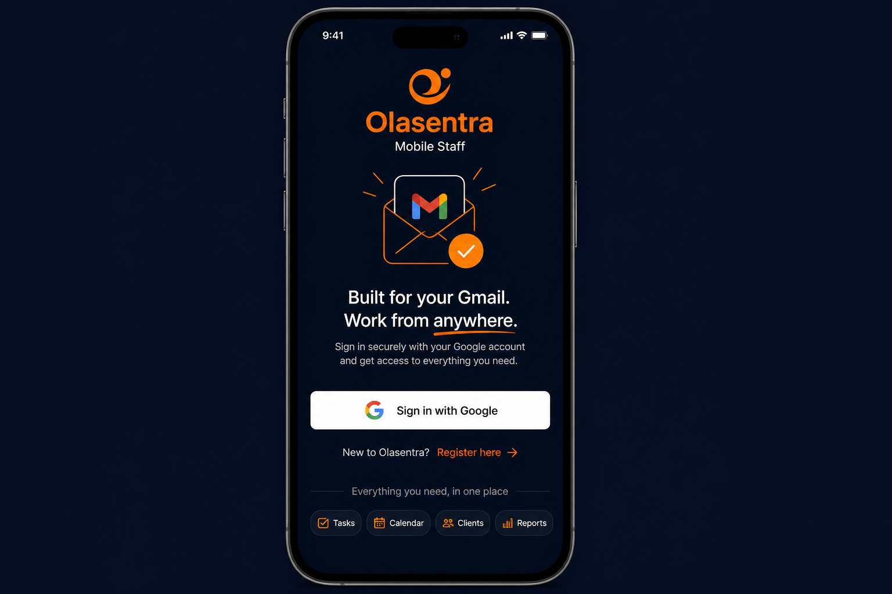
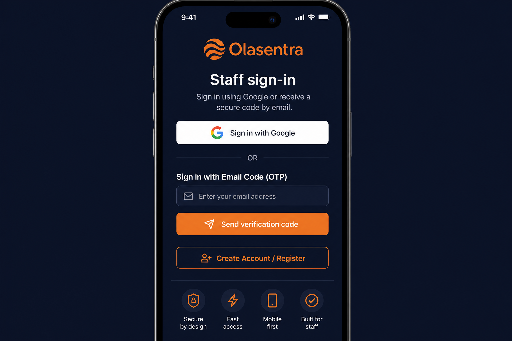

# Phase 5C — Staff PWA Login Parity (Revised Product Decision)

**Status:** Complete locally — **not deployed** (awaiting review and approval)

**Date:** 2026-06-21

## Approved product decision

Staff PWA login methods:

| Method | Status |
|--------|--------|
| Google Sign In | Enabled, visible, primary |
| Email OTP Sign In | Enabled, visible, equal first-class option |
| Create Account / Register | Enabled, visible |

**Not approved on Staff PWA:** Email + PPS login (may continue elsewhere for venue/legacy workflows only).

## Before / After

| Before | After (revised) |
|--------|-----------------|
| Google sign-in only | Google + Email OTP |
| No OTP UI | OTP wired to production portal endpoints |
| — | No PPS form, button, or fallback on PWA login |





## Required login screen

```
Staff sign-in
Sign in using Google or receive a secure code by email.

[ Sign in with Google ]

        or

Sign in with Email Code (OTP)
[ email ] [ Send verification code ]

[ Create Account / Register ]
```

## Files modified (this revision)

| File | Change |
|------|--------|
| `includes/staff-app-easy.php` | Removed PPS login UI; updated approved copy and register label |
| `scripts/phase5c-login-parity-test.php` | Asserts PPS absent; validates approved copy |
| `docs/PHASE5C-STAFF-PWA-LOGIN-PARITY.md` | This report |
| `docs/phase5c-after-login.png` | Revised after mockup |

## Files unchanged from initial Phase 5C (still in scope for deploy)

| File | Role |
|------|------|
| `includes/staff-app-v3-shell.php` | Guest OTP script load |
| `assets/css/staff-app-v3.css` | OTP styles; standalone install hide |
| `assets/js/staff-app-v3.js` | Hide install row in standalone |
| `includes/staff-portal-email-otp.php` | Portal OTP backend (restored) |
| `api/staff-portal-otp-send.php` | Send endpoint (restored) |
| `api/staff-portal-otp-verify.php` | Verify endpoint (restored) |
| `assets/js/staff-portal-email-otp.js` | Client OTP flow (restored) |
| `includes/mobile/services/MobileOtpService.php` | `staff_portal` purpose parity |
| `includes/settings-repository.php` | OTP setting defaults |

## What was NOT changed

- Google OAuth logic
- OTP verification logic (`mobileOtpVerify` body)
- Session handling
- Database schema
- API contracts
- `handleStaffPortalVerifyPost()` in `staff-profile-gate.php` (PPS auth remains for non-PWA flows; not exposed on PWA UI)
- Production data

## PWA install rule

Install prompts:

- Shown when not installed (browser + `beforeinstallprompt`)
- Hidden when installed / dismissed
- Hidden in standalone mode (CSS `@media (display-mode: standalone)` + JS)

## Risk assessment

| Area | Risk | Mitigation |
|------|------|------------|
| PPS removed from PWA UI only | Low | Venue/legacy PPS flows unchanged elsewhere |
| Auth regression | Medium | Google + OTP paths unchanged; static + lint tests pass |
| User confusion | Low | Clear dual-method copy per product decision |
| Deploy scope | Medium | 10 files; scoped deploy script recommended |

## Regression test results

```
php scripts/phase5c-login-parity-test.php
```

**Result:** 28/28 PASS

Key assertions:

- Google button present
- OTP section present with approved title
- Approved hero copy present
- `Create Account / Register` link present
- No `staff_portal_verify`, `pps_last4`, or PPS section in login UI
- PHP lint clean on all touched files

### Manual test plan (post-deploy)

1. Guest `staff-app.php` — Google + OTP visible; **no PPS form**
2. Google sign-in → same dashboard as before
3. Email OTP send → verify → same staff profile
4. Register link opens registration site
5. Standalone PWA — no install banner/row on home

## Deployment

**Do not deploy until review and approval.**
