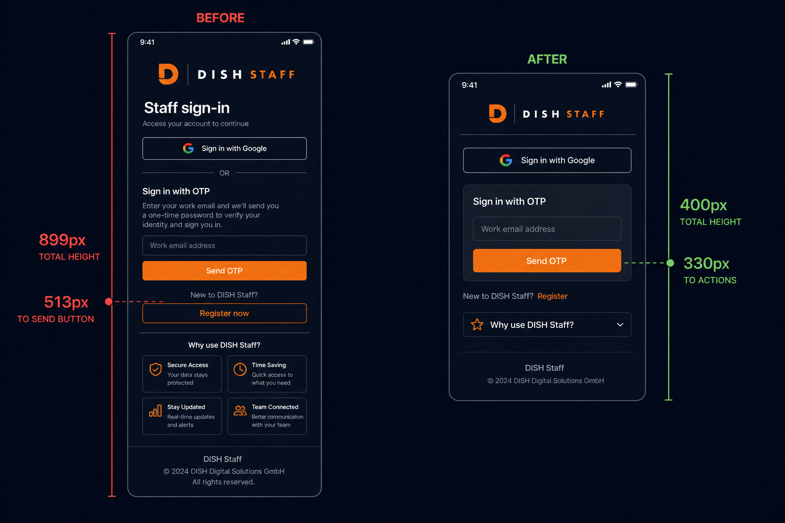

# Phase 8 — Login Compactness Audit

**Scope:** Staff PWA guest login (`staff-app.php` → `renderStaffAppGuestEasyPage`)  
**Status:** Audit only — **no code changes, no deployment**

**Sources reviewed:**
- `includes/staff-app-easy.php` (markup)
- `assets/css/staff-app-v3.css` (`.es-v3-login*`, `.es-v3--guest`)
- `includes/staff-app-v3-shell.php` (guest shell, PWA banner, main padding)

**Design goal:** On a standard Android phone, a staff member should see **Google Login**, **Email OTP field**, and **Verify** (after code sent) within the first viewport **without excessive scrolling**.

---

## 1. Compactness audit — current measurements

Assumption: root `1rem = 16px`, `line-height` as declared, no user font scaling (`text-size-adjust: 100%`).

### Shell / viewport

| Property | Value | Pixels |
|----------|-------|--------|
| Viewport meta | `width=device-width, viewport-fit=cover` | Full device width |
| Guest main padding | `1rem` top/sides, `calc(safe-area + 1.5rem)` bottom | **16** top, **16** sides, **24+** bottom |
| Guest main layout | `justify-content: center` | Vertically centers block — pushes content off top when tall |
| Max content width | `480px` | — |
| Body font | `15px`, line-height `1.45` | — |

**Reference viewports (typical CSS px):**

| Device | Viewport | Usable height (browser chrome ~80–100px) |
|--------|----------|------------------------------------------|
| Galaxy A / budget Android | 360 × 740 | **~640–660px** |
| Pixel / mid Android | 412 × 915 | **~820–840px** |
| iPhone 14 Safari | 390 × 844 | **~740–760px** |

### Header block (`.es-v3-login__header`)

| Element | CSS | Height / space |
|---------|-----|----------------|
| Logo wrap | `40×40px` | **40px** row |
| Brand `h1` | `1.125rem`, weight 700 | **~18px** text |
| Brand tagline | `0.75rem`, `margin-top: 0.125rem` | **~12px** |
| Header gap | `0.75rem` | 12px (horizontal) |
| **Header block total** | max(40, ~32 text) | **~40px** |
| Margin below header | `1.75rem` | **+28px** → **68px** consumed |

### Hero block (`.es-v3-login__hero`) — duplicate messaging

| Element | CSS | Height / space |
|---------|-----|----------------|
| `h2` “Staff sign-in” | `1.625rem`, `margin-bottom: 0.375rem` | **~31px** |
| Lead paragraph | `0.9375rem`, `line-height: 1.5`, max 28ch | **~22px** (1 line typical) |
| Margin below hero | `1.5rem` | **+24px** → **~77px** consumed |

### Google CTA

| Element | CSS | Height / space |
|---------|-----|----------------|
| Button | `min-height: 52px`, `padding 0 1.25rem` | **52px** |
| CTA margin-bottom | `0.875rem` | **+14px** → **66px** |

### Divider “or”

| Element | CSS | Height / space |
|---------|-----|----------------|
| Vertical margins | `1.25rem 0` | **40px** |
| Text line | `0.8125rem` uppercase | **~13px** → **~53px** |

### OTP section (email step — default visible)

| Element | CSS | Height / space |
|---------|-----|----------------|
| Section title | `0.9375rem`, `margin-bottom: 0.25rem` | **~19px** |
| Lead copy | `0.8125rem`, `margin-bottom: 0.875rem` | **~33px** |
| Panel padding | `1rem` all sides | **32px** vertical |
| Label | `0.8125rem` | **~13px** |
| Step gap | `0.625rem` × 2 | **20px** |
| Email input | `min-height: 48px` | **48px** |
| Send button | `min-height: 48px`, `margin-top: 0.25rem` | **52px** |
| Section margin-bottom | `1rem` | **16px** |
| **OTP email step total** | — | **~233px** |

### OTP section (code step — after send)

| Element | vs email step | Delta |
|---------|---------------|-------|
| “Code sent to…” | replaces email label+input | **+~4px** |
| Code input | same 48px | — |
| Verify button (primary) | same 52px as Send | — |
| “Use a different email” link | **+~28px** | |
| **Code step total** | — | **~288px** (+55px vs email step) |

### Below auth (always rendered — drives scroll)

| Block | CSS driver | Height |
|-------|------------|--------|
| Register link | `min-height: 48px`, `margin-bottom: 1.75rem` | **~76px** |
| Features grid (2×2) | `min-height: 88px` × 2 rows, `gap: 0.75rem`, `margin-bottom: 1.75rem` | **~216px** |
| Footer + secure badge | 2 paragraphs + pill | **~70px** |

---

## 2. Current screen height usage

### Cumulative stack (Google + OTP enabled, no alerts)

| Zone | Email step (Send visible) | Code step (Verify visible) |
|------|---------------------------|----------------------------|
| Main top padding | 16 | 16 |
| Header + margin | 68 | 68 |
| Hero + margin | 77 | 77 |
| Google + margin | 66 | 66 |
| Divider | 53 | 53 |
| OTP section | 233 | 288 |
| **Subtotal — core auth** | **513px** | **568px** |
| Register | 76 | 76 |
| Features grid | 216 | 216 |
| Footer | 70 | 70 |
| Main bottom padding | 24 | 24 |
| **Full page total** | **~899px** | **~954px** |

### Viewport fit analysis

| Scenario | 360×740 (~660px usable) | 412×915 (~830px usable) |
|----------|-------------------------|---------------------------|
| Google + email + **Send** visible without scroll | **Borderline** (~513px vs ~660px — fits if centered doesn’t clip; tight with PWA banner) | **Yes** |
| Google + email + **Verify** visible (code step) | **Requires scroll** (~568px core; OK alone, but Register starts ~569px — Verify often near fold edge) | **Yes** (Verify ~568px, Register below fold) |
| Full page (incl. features) | **~240px scroll** minimum | **~70px scroll** |

### Primary compactness problems (ranked)

1. **Triple headline stack** — header tagline + hero `h2`/lead + OTP title/lead repeat “sign in” messaging (~**110px** copy overhead).
2. **Hero block** — largest single removable block above auth (~**77px**).
3. **Features grid on login** — marketing tiles not required for sign-in (~**216px** scroll).
4. **Generous vertical rhythm** — header/hero/divider margins use `1.25–1.75rem` (~**52px** recoverable in gaps alone).
5. **Touch targets slightly oversized** — Google **52px**, inputs/buttons **48px** (acceptable a11y, but **8–16px** recoverable per control).
6. **`justify-content: center`** on guest main — when content exceeds viewport, top of form scrolls away first; works against “auth at top” goal.

---

## 3. Recommended compact layout

**Principle:** One brand row → auth actions → optional secondary links. Defer marketing/footer below fold or collapse.

### Proposed structure (top → bottom)

```
┌─────────────────────────────────────┐
│ [32px logo] Olasentra               │  ← single line brand (drop tagline or inline)
│ Staff sign-in                       │  ← one h1 only (18–20px), no hero paragraph
├─────────────────────────────────────┤
│ [ Google — 44px ]                   │
│ ─────── or ───────                  │  ← tighter margins (8px vertical)
│ Email                               │  ← label inline or 11px caption
│ [ email input — 44px ]              │
│ [ Send code — 44px ]                │
│   — OR after send —                 │
│ [ 000000 — 44px ]                   │
│ [ Verify — 44px primary ]         │
├─────────────────────────────────────┤
│ Register · Help (text link row)     │  ← 36px, not 48px button
│ ▸ Features (collapsed accordion)    │  ← optional, default closed
│ Secure staff auth (one line)        │  ← 24px footer
└─────────────────────────────────────┘
```

### Target CSS tokens (implementation phase — not applied now)

| Token | Current | Recommended | Notes |
|-------|---------|-------------|-------|
| Header margin-bottom | 28px | **12px** | |
| Logo | 40px | **32px** | Still legible |
| Hero block | 77px | **0px** (merge) | Move “Staff sign-in” to brand row |
| Hero h2 size | 26px | **18–20px** | If kept as single title |
| Google btn height | 52px | **44px** | WCAG min touch 44px |
| Divider margins | 40px | **16px** | |
| OTP title + lead | 52px | **0–24px** | Title only or aria-label |
| OTP panel padding | 16px | **12px** | |
| Input / btn height | 48px | **44px** | |
| Step internal gap | 10px | **8px** | |
| Register control | 76px | **36px** | Text link style |
| Features grid | 216px | **0px default** | Collapsed or remove from login |
| Footer | 70px | **28px** | Single line + icon |
| Guest main align | `center` | **`flex-start`** + `padding-top: max(12px, safe)` | Auth anchored to top |

---

## 4. Pixels that can be recovered

| Change | Recovery | Risk |
|--------|----------|------|
| Remove hero paragraph | **~22px** | Low |
| Merge hero h2 into header / single title | **~55px** (incl. hero margin) | Low |
| Header margin 1.75→0.75rem | **16px** | Low |
| Divider margins 1.25→0.5rem | **24px** | Low |
| OTP lead removal (keep aria) | **~33px** | Low |
| OTP title → visually hidden / shorter | **~19px** | Low |
| Panel padding 16→12px | **8px** | Low |
| Google 52→44px | **8px** | Low (44px min touch) |
| Input + primary btn 48→44px (×2 email step) | **8px** | Low |
| Register as text link | **~40px** | Low |
| Features collapsed by default | **~216px scroll** | Medium (discoverability) |
| Footer one line | **~42px** | Low |
| `justify-content: flex-start` | **0px** but fixes fold behavior | Low |
| **Total — above-fold auth focus** | **~170–220px** | — |
| **Total — full page scroll** | **~380–430px** | — |

**Projected core auth height after compact layout:**

| Step | Current | Compact | Saved |
|------|---------|---------|-------|
| Email (Google + Send) | **513px** | **~310–340px** | **~170–200px** |
| Code (Google + Verify) | **568px** | **~365–395px** | **~170–200px** |

On **360×660px usable**, compact layout leaves **~270–300px** headroom for keyboard, PWA install banner (~56px), or error alerts — vs **~150px** today on email step.

---

## 5. Before / after wireframe

### BEFORE (current — approximate proportions, 360px wide)

```
┌──────────────────────────┐  ▲
│ [40] Olasentra           │  │ 68px  Header
│      Staff operations…   │  │
│                          │  │
│ Staff sign-in            │  │ 77px  Hero (large h2 + lead)
│ Sign in using Google…    │  │
│                          │  │
│ ┌──────────────────────┐ │  │ 66px  Google 52px
│ │  G  Sign in Google   │ │  │
│ └──────────────────────┘ │  │
│ ───────── or ─────────── │  │ 53px  Divider
│ Sign in with Email Code  │  │
│ We send a 6-digit code…  │  │ 233px OTP panel
│ ┌──────────────────────┐ │  │ (email + Send)
│ │ Staff email          │ │  │
│ │ [____________]       │ │  │
│ │ [ Send code      ]   │ │  │
│ └──────────────────────┘ │  ▼ ~513px — fold on many phones
│ ┌ Register (48px) ────┐ │  ← often first scroll target
│ │ My Shifts │ Check In │ │ 216px features
│ │ Messages  │ Documents│ │
│ └───────────────────────┘ │
│ Footer + secure badge     │ 70px
└──────────────────────────┘  ~899px total
```

### AFTER (recommended compact)

```
┌──────────────────────────┐  ▲
│ [32] Olasentra · Sign in │  │ 44px  Single brand row
│                          │  │
│ ┌──────────────────────┐ │  │ 58px  Google 44px
│ │  G  Sign in Google   │ │  │
│ └──────────────────────┘ │  │
│ ──── or ────             │  │ 29px  Tight divider
│ ┌──────────────────────┐ │  │
│ │ Email                │ │  │ ~200px OTP
│ │ [____________]       │ │  │ (email + Send OR code + Verify)
│ │ [ Send / Verify   ]  │ │  │
│ └──────────────────────┘ │  ▼ ~330px — fits first viewport
│ Register                 │  │ 36px link
│ ▸ App features           │  │ collapsed
│ 🔒 Secure authentication │  │ 28px
└──────────────────────────┘  ~400px total (minimal scroll)
```

### Visual wireframe (before / after)



### Mermaid — information hierarchy

```mermaid
flowchart TB
  subgraph before [Current login stack]
    H[Header 68px]
    R[Hero 77px]
    G[Google 66px]
    D[Divider 53px]
    O[OTP block 233px]
    Reg[Register 76px]
    F[Features 216px]
    Ft[Footer 70px]
    H --> R --> G --> D --> O --> Reg --> F --> Ft
  end

  subgraph after [Compact login stack]
    H2[Brand row 44px]
    G2[Google 58px]
    D2[Divider 29px]
    O2[OTP 200px]
    L[Links + collapsed 64px]
    H2 --> G2 --> D2 --> O2 --> L
  end
```



---

## 6. Estimated scroll reduction

| Metric | Current | After compact | Reduction |
|--------|---------|---------------|-----------|
| Pixels to “Send verification code” (from top) | **513px** | **~330px** | **~180px (35%)** |
| Pixels to “Verify and sign in” (code step) | **568px** | **~380px** | **~188px (33%)** |
| Full page height | **~899px** | **~400–480px** | **~420–500px (47–56%)** |
| Scroll on 360×660 usable (full page) | **~240px** | **0–40px** | **~200px** |
| Meets design goal (auth in first viewport) | **Partial** — Send OK on mid devices; Verify tight; features force scroll | **Yes** on 360×640+ with headroom | — |

---

## 7. Mobile UX report

### What works today

- Clear primary/secondary auth paths (Google vs OTP).
- Touch targets meet or exceed 44px (Google 52px, inputs 48px).
- Dark v3 palette and orange accent consistent with staff app.
- OTP panel visually grouped (glass card) — good affordance.
- `viewport-fit=cover` and safe-area padding on guest main.

### Friction points

| Issue | UX impact |
|-------|-----------|
| Repeated “sign in” copy in 3 zones | Cognitive noise; pushes auth down |
| Large hero `h2` (26px) on mobile login | Feels like marketing landing, not utility login |
| Feature grid before footer | Implies scroll is required to “explore app” before signing in |
| Register as full-width 48px button | Competes visually with primary auth; adds 76px before features |
| Vertical centering | On short viewports, user lands mid-page; Google may be partially off-screen until scroll |
| PWA install banner (when shown) | Fixed bottom ~56px overlays Register/features — not auth, but adds clutter |
| Verify only on step 2 | Expected flow, but code step adds **+55px** — tight on 360×640 with keyboard open |

### Keyboard interaction (OTP email step)

When soft keyboard opens (~40–50% viewport height on small Android):

- Visible area **~330–400px**.
- Current core auth **513px** → **email field and Send likely hidden** without scroll.
- Compact target **~330px** → **Google + email + Send remain partially visible** with scroll-to-field behavior.

---

## 8. Risk assessment

| Change area | Risk | Mitigation |
|-------------|------|------------|
| Reduce button/input heights to 44px | **Low** | Keep ≥44px; test Samsung Internet + Chrome |
| Remove hero / shorten copy | **Low** | Preserve `aria-labelledby` on OTP section |
| Hide/collapse features grid | **Medium** | Optional expand; or move to post-login onboarding |
| Register as text link | **Low** | Maintain contrast and tap area (min 44×44 hit slop) |
| Remove OTP lead text | **Low** | Screen readers: `aria-describedby` on panel |
| `flex-start` vs `center` | **Low** | Better fold predictability; visual QA on tall phones |
| Shrink logo 40→32px | **Low** | Test with wide brand assets |
| **Auth / OTP / OAuth logic** | **Out of scope** | CSS/markup-only phase — no API or flow changes |
| **Touch target regression** | **Medium** if below 44px | Audit all interactive elements after implementation |

**Protected areas (must not change in implementation phase):** OTP send/verify endpoints, Google OAuth URLs, CSRF, step toggling JS, database, attendance/GPS/BIB.

---

## 9. Implementation recommendation (future phase — not executed)

**Phase 8B — Login compactness (CSS + markup only):**

1. Guest-only CSS block or `@media (max-height: …)` overrides.
2. Collapse hero into single brand title row.
3. Tighten spacing tokens under `.es-v3-login`.
4. Convert Register to tertiary link; collapse `.es-v3-login__features` (details/summary or remove).
5. Set `.es-v3--guest .es-v3__main { justify-content: flex-start; padding-top: … }`.
6. Device QA matrix: 360×640, 412×915, iPhone Safari, keyboard open/closed.

**Estimated effort:** 2–4 hours CSS/markup + device pass. **No deployment** until approved.

---

## 10. Summary

| Deliverable | Finding |
|-------------|---------|
| **Compactness audit** | Core auth stack **513–568px**; full page **~899px** — hero, divider margins, OTP copy, and features grid are main consumers |
| **Mobile UX report** | Send button fits mid-tier Android; Verify and keyboard scenarios need scroll today; vertical centering hurts short viewports |
| **Recommended layout** | Single brand row → 44px controls → tight OTP card → text Register → collapsed features |
| **Pixels recoverable** | **~170–220px** above-fold; **~420px** full-page scroll |
| **Scroll reduction** | **~35%** to primary actions; **~47–56%** full page |
| **Risk** | **Low** for spacing/typography; **medium** only if features hidden or touch targets shrink below 44px |

**Verdict vs design goal:** Current layout is **partially compliant** — Google + email Send fit on many devices, but **Verify**, **keyboard**, and **360×640** cases fail “no excessive scrolling.” Recommended compact layout **meets the goal** without auth logic changes.

---

**Related:** [`PHASE8-POST-DEPLOY-VALIDATION-REPORT.md`](PHASE8-POST-DEPLOY-VALIDATION-REPORT.md) · [`PHASE6-STAFF-PWA-UI-UX-AUDIT.md`](PHASE6-STAFF-PWA-UI-UX-AUDIT.md)
